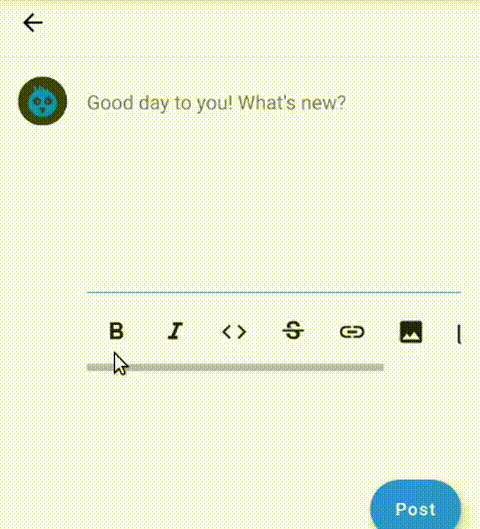

I'm currently working on an app called [Goryon](https://github.com/jointwt/goryon) - A twtxt mobile app. One of the few features of the app is it enables you to compose twts (kinda like your twitter message but it allows you to use Markdown). 

## Final Product



## Let's get started
To do that you'll need a `TextEditingController` that is connected to a `TextField`

```dart
_textController = TextEditingController()


....

TextFormField(
                        autofocus: true,
                        maxLines: 8,
                        controller: _textController
                        )
```


Then I created a function that surrounds the highlighted text in the text box with a  markdown syntax

```dart
  void _surroundTextSelection(String left, String right) {
    final currentTextValue = _textController.value.text;
    final selection = _textController.selection;
    final middle = selection.textInside(currentTextValue);
    final newTextValue = selection.textBefore(currentTextValue) +
        '$left$middle$right' +
        selection.textAfter(currentTextValue);

    _textController.value = _textController.value.copyWith(
      text: newTextValue,
      selection: TextSelection.collapsed(
        offset: selection.baseOffset + left.length + middle.length,
      ),
    );
  }
  ```

**left** is the string on the left hand side. **right** is the string on the right hand side. 

This is how bolding a text would look like: 
 ```dart
_surroundTextSelection('**', '**')
```

Adding a code block
 ```dart
_surroundTextSelection('```', '```')
```

Adding an Image
```dart
_surroundTextSelection(''),
```

You get the point. 


Check the full code in this [repo](https://github.com/jointwt/goryon/blob/736a98631e4ce617c476ffc4d4f5f9a6575705ef/lib/screens/newtwt.dart#L81). That's all for now!

